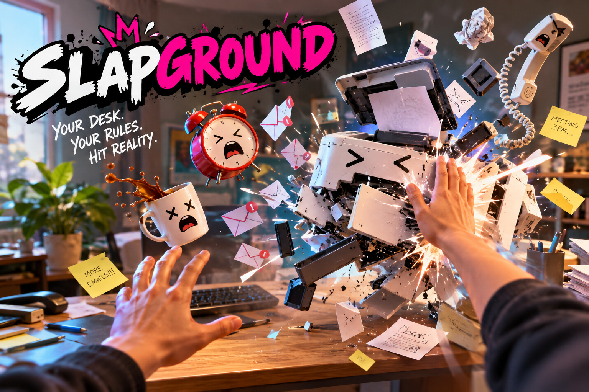
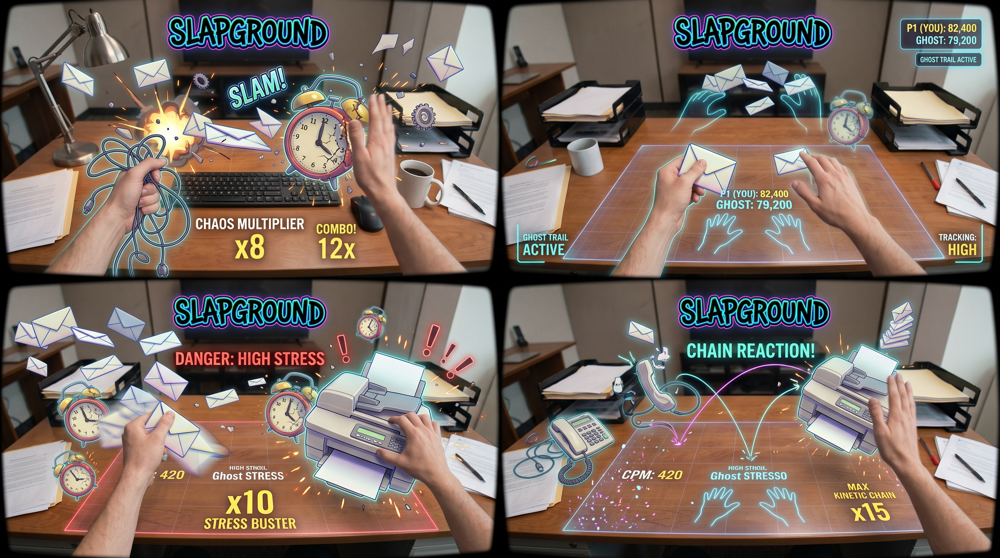
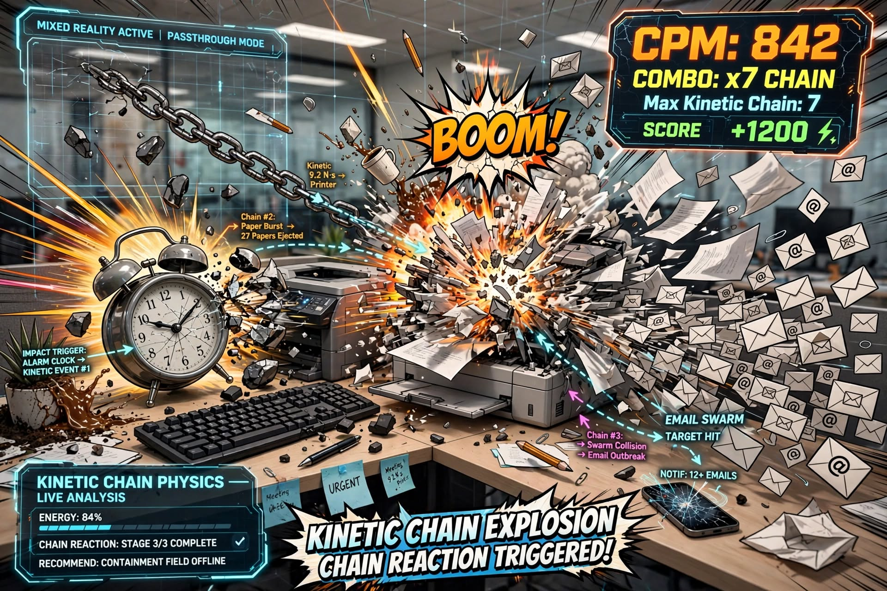
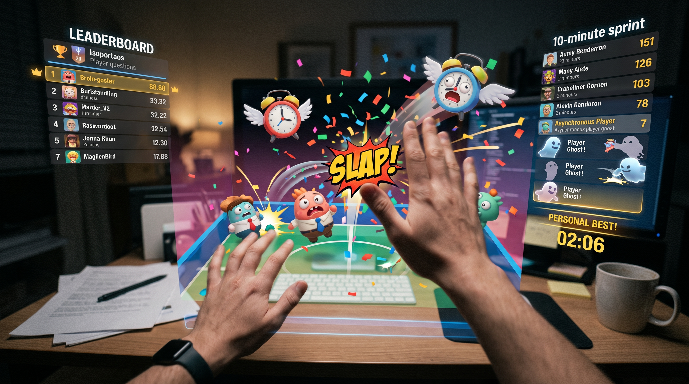

# SLAPGROUND

[English](./README.md) · [Español](./README_ES.md) · [**Technical README**](./README_TECHNICAL.md)

### A bad day at the office, and your real desk is where you take it out.

You had the day everyone's had: the printer jammed, the inbox wouldn't stop, the phone wouldn't shut up. SLAPGROUND is a seated mixed-reality game for Meta Quest where those exact objects — the alarm clock, the printer, the email swarm, the corded phone — appear floating over your *actual desk*, and you deal with them the obvious way: with your bare hands, no controllers.


*AI-generated concept art (Gemini/ChatGPT) — illustrative only. No build exists yet; this is not gameplay footage.*

---

## What it is

Grab one object, slap it with your other hand, and watch it react: a light object ricochets wildly, a heavy one needs a few hits before it goes flying, a corded phone becomes a flail you can swing into something else. Nothing is scripted — the chaos comes from how different objects' weight, fragility, and shape interact with each other and with your real desk surface.


*AI-generated concept art — illustrative only, not a captured interaction.*

A session is short on purpose: a few minutes of escalating chaos, capped by ten seconds where everything on the desk is fair game — hit it all, as hard and as fast as you can.

## Why it's worth coming back to

Anyone can land a satisfying first slap in seconds. Getting good takes longer: timing a hit so an object ricochets into a second one, chaining several objects into one long combo, learning which object does what to which. That's where the competitive hook lives — not a live opponent, but a ghost trail of your own or a friend's best run, a chaos-per-minute score, and a clip of your best chain, generated automatically, ready to send.


*AI-generated concept art — illustrative only.*


*AI-generated concept art — illustrative only.*

## What's actually different here

| Typical VR "break things" experience | SLAPGROUND |
|---|---|
| A generic virtual room | Your real desk, via passthrough — the bank-shots land on your actual table |
| Destruction as the whole pitch | Destruction is the fantasy; object-property combinations are the game |
| Scripted levels for depth | Depth emerges from a handful of combinable physical properties |
| Live rival hologram, or no competitive loop | A faint ghost trail of a past run — competitive without the visual clutter of a live opponent's arms |

## Where this stands right now

**This is a tested hypothesis, not a finished game.** Before any of the above gets built for real, the one thing that has to be proven on an actual Quest headset is whether it can reliably track a fast, two-handed slap at all — nobody has publicly shown that solved yet, including in the two titles Meta itself points to as references for hands-first design. That research, the full validation plan, and every design decision behind it are documented in depth in the [Technical README](./README_TECHNICAL.md).

**A note on the concept art above:** it was commissioned 2026-10-05, before D4 (`README_TECHNICAL.md` section 2) bound the design to the competition's own "two-foot radius, no large physical movement" rule on 2026-10-09. All four images show interactions and chain reactions spanning the full width of a desk — hands reaching to opposite edges, a chain graphic connecting objects placed far apart — wider than what the committed design will actually deliver. Treat this art as mood/tone reference only, not a literal promise about play-space size; it predates the constraint it would otherwise need to honor. Don't reuse it in submission material without that caveat, and don't commission new art assuming the old brief until this is explicitly revisited.

```
splapground/
├── README.md              # this file
├── README_ES.md            # Spanish version
├── README_TECHNICAL.md     # architecture, validation protocol, sourced research, decisions
├── BRAINSTORM.md            # raw original brainstorm, unedited
├── docs/
│   ├── concept-art/         # illustrative AI-generated images referenced above
│   └── setup/
│       └── QUEST_SETUP.md   # manual Unity Hub / SDK / build-and-deploy steps, not yet run
├── unity/                   # Unity project (created by opening this folder in Unity Hub,
│   └── Assets/              # see docs/setup/QUEST_SETUP.md — no Editor was available to
│       └── SlapgroundSpike/ # generate ProjectSettings/Packages here, only Assets/ exists
└── core/                     # Slapground.Core — plain .NET, no Unity needed; see core/README.md
    ├── Slapground.Core/       # D2 properties/breakage, session clock, chain/CPM,
    │                          # highlight selection, ghost pacing, session summary
    └── Slapground.Core.Tests/ # 102 passing xUnit tests, actually run with `dotnet test`
```

Built for the **Meta VR Start Developer Competition 2026** (Gaming track, hands-first, New Experience division — deadline Nov 18, 2026). For the validation protocol, the competitive research behind the claims above, the architectural decisions, and the open risks, see the [Technical README](./README_TECHNICAL.md).
